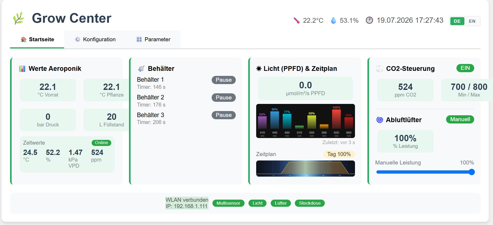

# MasterAeroponik

**[Deutsch](#deutsch) | [English](#english)**

---

## Deutsch

Private Steuerung für ein Aeroponik-Growzelt auf Basis mehrerer ESP32-Firmwares. Ein zentraler Master (ESP32-S3) übernimmt Bewässerung, Beleuchtung, Klimaregelung und Datenlogging; fest verdrahtete RS485-Geräte und drahtlose ESP-NOW-Nodes liefern Sensordaten und schalten Aktoren.

### Projekte

Multi-Root-Workspace, öffnen über `Aeroponik.code-workspace` (VSCode + [pioarduino](https://github.com/pioarduino)-Extension — Ersatz für die offizielle PlatformIO-Extension, da PlatformIO das aktuell genutzte ESP32-Arduino-Framework nicht unterstützt):

| Projekt | MCU | Anbindung | Funktion |
|---|---|---|---|
| `Aeroponik` | ESP32-S3 N16R8 | LAN (W5500) + WiFi | Master: Weboberfläche, Ventile, Scheduler, RS485-Bus-Master, ESP-NOW-Master |
| `Lichtx4` | ESP32 | RS485 | 4× Relais-Lichtsteuerung, vom Master über den Beleuchtungs-Scheduler angesteuert |
| `Multisensor` | ESP32-C3 | RS485 oder ESP-NOW | Zelt-Klima (SCD41: CO₂/Temp/Feuchte) + PPFD/Spektrum (AS7341) |
| `Steckdosen` | ESP32 | ESP-NOW | Allgemeine Relais-Nodes (u. a. Ziel der CO2-Steuerung) |
| `shared/espnow_common` | — | — | Gemeinsam genutzte ESP-NOW-Protokoll-Library für Master/Multisensor/Steckdosen |

### Funktionsübersicht

- **Bewässerung** — 3 unabhängige Ventilkreise (Öffnungszeit + Pausenintervall) plus optionaler Rücklauf-Vorlauf
- **Tanküberwachung** — Ultraschall-Füllstand, Volumenberechnung über die konische Tankgeometrie
- **Beleuchtungs-Scheduler** — simuliertes Sonnenauf-/-untergang über bis zu 4 Kanäle, angesteuert über Lichtx4 (RS485)
- **Zeltklima** — CO₂, Temperatur, Luftfeuchte sowie PPFD/Spektrum über den RS485-Multisensor
- **Raumklima & VPD** — AHT21B als Referenzsensor außerhalb des Zelts, daraus berechneter VPD-Wert (Tetens-Formel)
- **CO2-Steuerung** — Hysterese-Regelung eines CO₂-Ausgangs auf einem ESP-NOW-Steckdosen-Node
- **Abluftlüfter-Steuerung** — MARS-Hydro-Lüfter über RS485, manuell oder automatisch (Luftfeuchte, Zelttemperatur absolut/differenz zur Raumtemperatur)
- **Wählbarer Analog-Ausgang (0-10V)** — Licht und/oder Lüfter alternativ über ein RS485-2-Kanal-Analogmodul statt Lichtx4/MARS Hydro ansteuerbar, Auswahl als Setup-Entscheidung (bestimmt auch, welche Geräte überhaupt gepollt werden)
- **SD-Karten-Log** — CSV pro Tag mit allen Sensor-/Steuerwerten, Download und Löschen direkt über die Weboberfläche
- **WLAN-Konfiguration** — SSID/Passwort werden über die Weboberfläche gesetzt und im Flash gespeichert (nicht im Quellcode); ohne erreichbares WLAN startet automatisch ein Fallback-Hotspot zur (Re-)Konfiguration
- **Ethernet + WiFi parallel** — Weboberfläche über LAN (W5500) und WiFi gleichzeitig erreichbar
- **OTA-Updates** — sowohl für den Master als auch für einzelne ESP-NOW-Nodes über die Weboberfläche
- **Node-Ökosystem** — ESP-NOW-Nodes registrieren sich automatisch beim Master, Online-/Offline-Status wird live erkannt

### Dokumentation

Ausführliche technische Dokumentation (Hardware/Pinouts, RS485- und ESP-NOW-Protokoll, Register, Konfigurationsparameter, Erststart, Serial-Kommandos) liegt unter [`Aeroponik/docs/index.html`](Aeroponik/docs/index.html) — lokal im Browser öffnen. Die Seite ist deutsch/englisch umschaltbar. Auch die Weboberfläche des Masters selbst ist zweisprachig (DE/EN-Umschalter im Header).

### Ersteinrichtung

1. Firmware der gewünschten Projekte per pioarduino flashen.
2. Der Master startet ohne gespeichertes WLAN automatisch als Access Point (SSID `ESP32-Aeroponik`, Standardpasswort `12345678`) — verbinden und über die Weboberfläche unter *Konfiguration → WLAN* die Zugangsdaten des Heim-WLANs setzen. Der Master startet danach automatisch neu und verbindet sich.
3. Weitere Details siehe HTML-Dokumentation.

---

## English

Private controller for an aeroponic grow tent, built on several ESP32 firmwares. A central master (ESP32-S3) handles irrigation, lighting, climate control, and data logging; hard-wired RS485 devices and wireless ESP-NOW nodes provide sensor data and switch actuators.

### Projects

Multi-root workspace, open via `Aeroponik.code-workspace` (VSCode + [pioarduino](https://github.com/pioarduino) extension — a drop-in replacement for the official PlatformIO extension, since PlatformIO doesn't support the ESP32 Arduino framework version used here):

| Project | MCU | Link | Function |
|---|---|---|---|
| `Aeroponik` | ESP32-S3 N16R8 | LAN (W5500) + WiFi | Master: web interface, valves, scheduler, RS485 bus master, ESP-NOW master |
| `Lichtx4` | ESP32 | RS485 | 4× relay light control, driven by the master's lighting scheduler |
| `Multisensor` | ESP32-C3 | RS485 or ESP-NOW | Tent climate (SCD41: CO₂/temp/humidity) + PPFD/spectrum (AS7341) |
| `Steckdosen` | ESP32 | ESP-NOW | General-purpose relay nodes (e.g. target of CO2 control) |
| `shared/espnow_common` | — | — | Shared ESP-NOW protocol library used by master/Multisensor/Steckdosen |

### Features

- **Irrigation** — 3 independent valve circuits (open time + pause interval) plus optional return pre-flush
- **Tank monitoring** — ultrasonic fill level, volume calculation via the conical tank geometry
- **Lighting scheduler** — simulated sunrise/sunset over up to 4 channels, driven via Lichtx4 (RS485)
- **Tent climate** — CO₂, temperature, humidity, and PPFD/spectrum via the RS485 multisensor
- **Room climate & VPD** — AHT21B as a reference sensor outside the tent, VPD calculated from it (Tetens formula)
- **CO2 control** — hysteresis control of a CO₂ output on an ESP-NOW socket node
- **Exhaust fan control** — MARS Hydro fan over RS485, manual or automatic (humidity, tent temperature absolute/differential to room temperature)
- **Selectable analog output (0-10V)** — light and/or fan can alternatively be driven via an RS485 2-channel analog module instead of Lichtx4/MARS Hydro, selected as a setup-time decision (also determines which devices are polled at all)
- **SD card logging** — daily CSV with all sensor/control values, download and delete directly via the web interface
- **WiFi configuration** — SSID/password are set via the web interface and stored in flash (not in source code); a fallback hotspot starts automatically for (re-)configuration if no WiFi is reachable
- **Ethernet + WiFi in parallel** — web interface reachable over both LAN (W5500) and WiFi simultaneously
- **OTA updates** — for both the master and individual ESP-NOW nodes via the web interface
- **Node ecosystem** — ESP-NOW nodes register with the master automatically, online/offline status is detected live

### Documentation

Detailed technical documentation (hardware/pinouts, RS485 and ESP-NOW protocol, registers, configuration parameters, first boot, serial commands) lives at [`Aeroponik/docs/index.html`](Aeroponik/docs/index.html) — open locally in a browser. The page has a German/English toggle. The master's own web interface is bilingual too (DE/EN switch in the header).

### First-time setup

1. Flash the firmware of the desired projects via pioarduino.
2. Without a saved WiFi network, the master automatically starts as an access point (SSID `ESP32-Aeroponik`, default password `12345678`) — connect to it and set your home WiFi credentials via the web interface under *Configuration → WiFi*. The master then restarts automatically and connects.
3. See the HTML documentation for further details.
